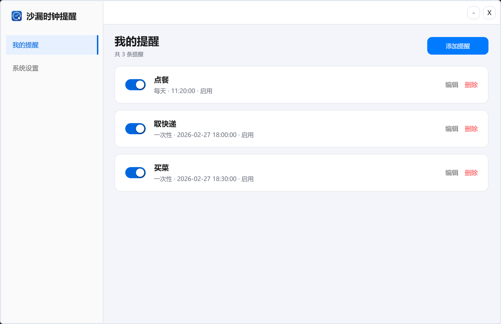
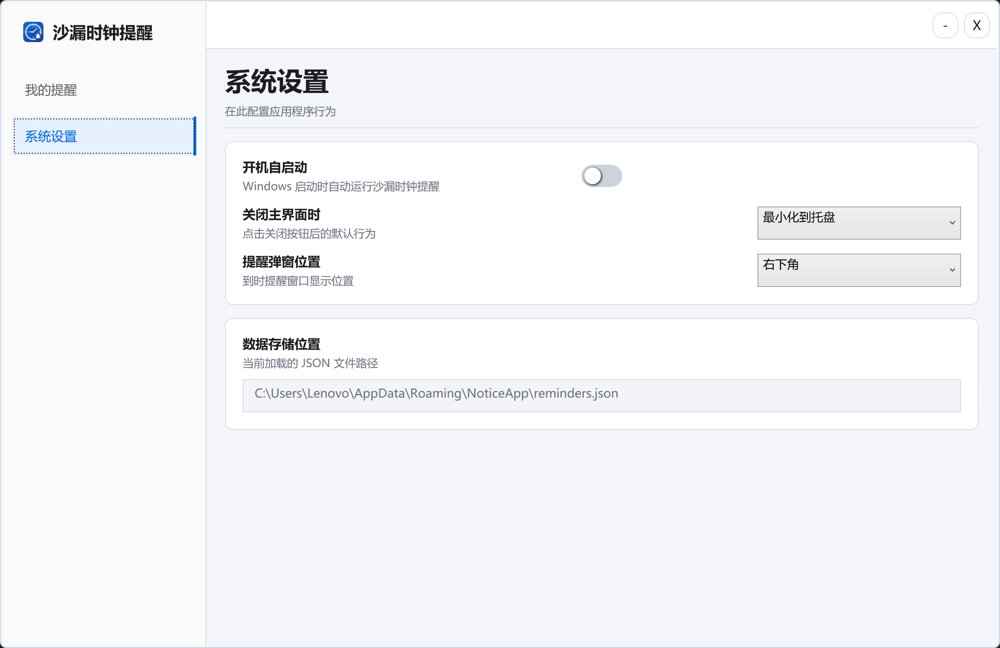
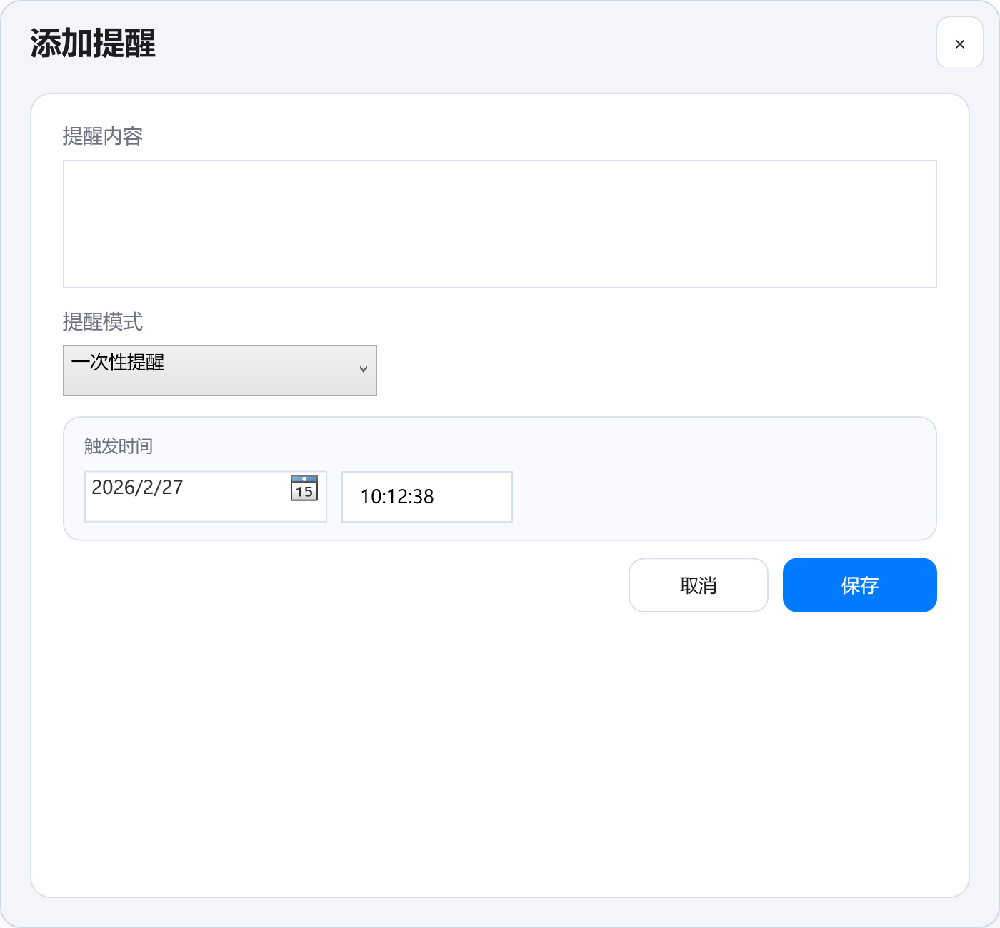

# 沙漏时钟提醒.exe

基于 `.NET 8 + WPF` 的 Windows 桌面提醒应用。  
支持一次性/周期性提醒、系统托盘驻留、开机自启动、可配置提醒弹窗位置，并支持单文件 `exe` 打包发布。

下载地址：






## 1. 功能概览

- 提醒类型
  - 一次性提醒：指定具体日期和时间触发。
  - 周期性提醒：支持每天、每周（可选星期几）、每月（指定日期）触发。
- 提醒管理
  - 添加、编辑、删除提醒。
  - 启用/禁用提醒。
  - 一次性提醒触发后自动标记完成并停用。
- 通知弹窗
  - 置顶显示（`Topmost`）。
  - 默认右下角弹出，可在设置页切换为右上角/中间。
  - 需要用户点击“已知晓”后关闭。
- 托盘运行
  - 启动后自动隐藏到托盘。
  - 托盘双击恢复主窗口。
  - 托盘右键菜单支持“打开主界面 / 退出程序”。
  - 点击窗口关闭按钮时可选择“最小化到托盘”或“直接退出程序”。
- 开机自启动
  - 设置页提供开关，写入当前用户注册表启动项。

## 2. 技术栈

- 平台：Windows
- 框架：`.NET 8`、`WPF`
- 语言：`C#`
- UI：自定义无边框窗口 + `WindowChrome` + XAML 样式
- 定时检查：`DispatcherTimer`（每秒）
- 数据持久化：本地 `JSON`
- 托盘：`System.Windows.Forms.NotifyIcon`
- 日志：未处理异常写入本地 `error.log`

## 3. 项目结构

```text
notice-app/
├─ NoticeApp.Wpf/
│  ├─ Assets/                      # 图标与UI资源（含 app.ico）
│  ├─ Models/                      # Reminder、AppSettings 等模型
│  ├─ Services/
│  │  ├─ ReminderScheduler.cs      # 提醒调度计算
│  │  ├─ ReminderStore.cs          # reminders.json 读写
│  │  ├─ AppSettingsStore.cs       # settings.json 读写
│  │  ├─ StartupManager.cs         # 开机自启动注册表操作
│  │  └─ ErrorLogger.cs            # 异常日志写入
│  ├─ MainWindow.xaml(.cs)         # 主界面与托盘/调度逻辑
│  ├─ ReminderEditorWindow.xaml(.cs)
│  ├─ NotificationWindow.xaml(.cs)
│  ├─ App.xaml(.cs)
│  └─ NoticeApp.Wpf.csproj
├─ artifacts/                      # 打包输出目录
├─ 手动打包流程.md
└─ readme.md
```

## 4. 环境要求

- Windows 10/11（x64）
- .NET 8 SDK（开发/手动打包时需要）
  - 检查命令：
    - `dotnet --version`

## 5. 本地开发运行

在项目根目录 `f:\Desktop\qproject\demo\notice-app` （调整到你clone的本地目录）执行：

```powershell
dotnet restore NoticeApp.Wpf/NoticeApp.Wpf.csproj
dotnet run --project NoticeApp.Wpf/NoticeApp.Wpf.csproj
```

## 6. 数据与配置位置

应用运行时使用以下路径（当前用户）：

- 提醒数据：`%AppData%\NoticeApp\reminders.json`
- 应用设置：`%AppData%\NoticeApp\settings.json`
- 异常日志：`%AppData%\NoticeApp\error.log`

开机自启动注册表项：

- 键路径：`HKCU\Software\Microsoft\Windows\CurrentVersion\Run`
- 值名：`NoticeApp`
- 值内容：当前程序 `exe` 的绝对路径（带引号）

## 7. 单文件 EXE 打包

在项目根目录执行：

```powershell
dotnet restore NoticeApp.Wpf/NoticeApp.Wpf.csproj -r win-x64 -nologo

dotnet publish NoticeApp.Wpf/NoticeApp.Wpf.csproj `
  -c Release `
  -r win-x64 `
  -o artifacts/publish-single `
  -p:SelfContained=true `
  -p:PublishSingleFile=true `
  -p:IncludeNativeLibrariesForSelfExtract=true `
  -p:IncludeAllContentForSelfExtract=true `
  -p:EnableCompressionInSingleFile=true `
  -p:DebugType=None `
  -p:DebugSymbols=false `
  -nologo
```

默认输出文件：

- `artifacts\publish-single\NoticeApp.Wpf.exe`

如果要重命名为指定名称（例如 `沙漏时钟提醒.exe`）：

```powershell
Rename-Item -LiteralPath 'artifacts/publish-single/NoticeApp.Wpf.exe' -NewName '沙漏时钟提醒.exe' -Force
```

## 8. 图标说明

- 项目图标由 `NoticeApp.Wpf/Assets/app.ico` 决定（`NoticeApp.Wpf.csproj` 中的 `ApplicationIcon`）。
- 任务栏/程序文件图标以 `app.ico` 为准。
- 托盘图标优先尝试提取当前 `exe` 图标，失败时回退到 `Assets/icon-bell.png`。

## 9. 关键交互流程

1. 程序启动，加载 JSON 数据与设置。
2. 主窗口首次渲染后自动隐藏到托盘。
3. 托盘双击恢复窗口。
4. 到达提醒时间后显示通知弹窗并播放系统提示音。
5. 用户点击“已知晓”关闭弹窗。
6. 一次性提醒触发后自动完成；周期性提醒自动计算下一次触发时间。

## 10. 常见问题排查

- 打包失败，提示文件被占用
  - 先关闭正在运行的旧版 `exe`（含托盘驻留），再重新 `publish`。
- 图标更换后看起来没变化
  - Windows 图标缓存可能未刷新，可尝试改名 `exe`、换目录、或重启资源管理器。
- 开机自启动开关无法生效
  - 检查是否有安全软件/策略阻止注册表写入。
- 程序异常
  - 查看日志文件：`%AppData%\NoticeApp\error.log`。

## 11. 额外文档

- 详细打包说明：`手动打包流程.md`
